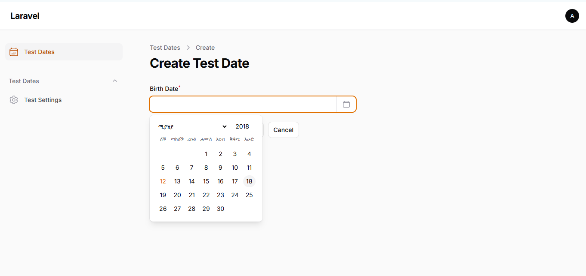
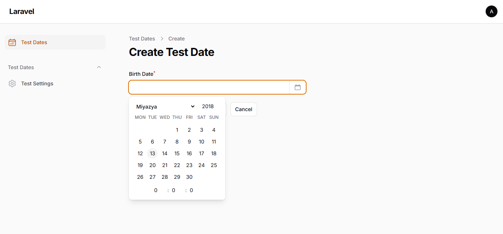
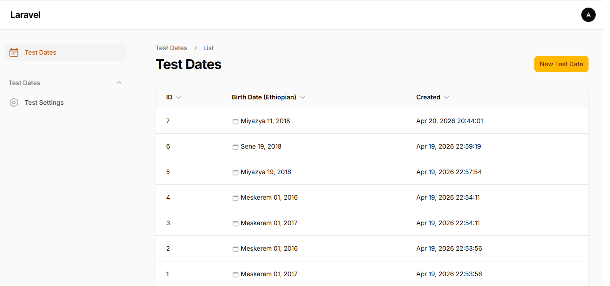

# Filament Ethiopic Date Picker

[](https://packagist.org/packages/mammesat/filament-ethiopic-date-picker)
[](https://packagist.org/packages/mammesat/filament-ethiopic-date-picker)
[](https://github.com/mammesat/filament-ethiopic-date-picker/actions?query=workflow%3ATests+branch%3Amain)
[](LICENSE)

A seamless, professional Ethiopic (Ge'ez) calendar integration for **Filament v5**. This plugin allows users to interact with the 13-month Ethiopian calendar through a beautiful, native-looking UI while maintaining standard Gregorian storage in your database.

Perfect for government systems, local Ethiopian businesses, and bilingual applications that require precise date management natively within the Filament ecosystem.

---

## ✨ Features

- **Native Filament Experience** — Blends perfectly with the Filament ecosystem using native styles, Tailwind CSS, and Alpine.js.
- **Gregorian DB Storage** — Dates are selected in Ethiopic but stored as standard `Y-m-d H:i:s` strings in your database, ensuring full compatibility with Laravel's Eloquent features and standard validation.
- **13-Month Support** — Full, mathematically accurate support for the Ethiopian calendar, including the 13th month (*Pagume*).
- **Time Picker Support** — Fully supports selecting hours, minutes, and seconds alongside the date.
- **Form Integration** — Powerful `EthiopicDatePicker` component with an interactive popup calendar.
- **Table Support** — `EthiopicDateColumn` for displaying localized dates beautifully in your resource tables.
- **Infolist Support** — `EthiopicDateEntry` for clean, read-only date displays on view pages.
- **7 Unique Display Modes** — Customizable formatting modes including Amharic, Transliteration, Hybrid, and Compact views.

---

## ⚙️ Requirements

| Package            | Version           |
| ------------------ | ----------------- |
| **PHP**      | `^8.2` (Supports 8.3+) |
| **Laravel**  | `^11.0 \| ^12.0 \| ^13.0` |
| **Filament** | `^5.0`          |

---

## 📦 Installation

Install the package via composer:

```bash
composer require mammesat/filament-ethiopic-date-picker
```

### Publish Configuration (Optional)

Publish the config file to globally customize default display modes, locales, and time picker settings:

```bash
php artisan vendor:publish --tag="filament-ethiopic-date-picker-config"
```

If you are upgrading or modifying configuration, it is recommended to clear your caches:

```bash
php artisan optimize:clear
```

---

## 🚀 Usage

### 📝 In Filament Forms

Add the `EthiopicDatePicker` to your form schema. It extends Filament's native `DateTimePicker` and inherits most of its powerful features.

```php
use Mammesat\FilamentEthiopicDatePicker\Forms\Components\EthiopicDatePicker;

EthiopicDatePicker::make('birth_date')
    ->label('Date of Birth')
    ->required()
    // Optional methods to customize behavior per-field:
    ->calendarLocale('en') // Force English transliteration UI
    ->withTime(false)      // Disable the time picker
    ->showEthiopicHelper(true) // Show the Ethiopic date as helper text below input
    ->showEthiopicSuffix(false); // Show the Ethiopic date as an input suffix
```

### 📊 In Filament Tables

Display dates perfectly formatted in the Ethiopian calendar within your resource tables:

```php
use Mammesat\FilamentEthiopicDatePicker\Tables\Columns\EthiopicDateColumn;
use Mammesat\FilamentEthiopicDatePicker\Enums\DisplayMode;

EthiopicDateColumn::make('created_at')
    ->label('Created (Ethiopic)')
    ->displayMode(DisplayMode::AmharicCombined)
    ->sortable();
```

### 📋 In Filament Infolists

Use the `EthiopicDateEntry` for elegant, read-only date displays on view pages:

```php
use Mammesat\FilamentEthiopicDatePicker\Infolists\Components\EthiopicDateEntry;

EthiopicDateEntry::make('registered_at')
    ->label('Registration Date');
```

---

## 🎨 Configuration & Display Modes

You can define global defaults in `config/ethiopic-calendar.php`:

```php
return [
    // How Ethiopic strings are visibly formatted
    'display_mode' => 'amharic_no_week',

    // Fallback locale if display_mode is dynamic
    'locale' => 'am',

    // Controls the language of month and day names in the calendar popup UI
    // 'am' (Amharic) or 'en' (English Transliteration)
    'calendar_locale' => 'am',

    // Enable or disable the time picker globally
    'with_time' => false,
];
```

### Available Display Modes

You can set these globally in the config or override them per-component using `->displayMode()`.

| Enum Value                  | Description                          | Example Output                              |
| --------------------------- | ------------------------------------ | ------------------------------------------- |
| `AmharicCombined`         | Fully localized Amharic with weekday | መስከረም 01, 2017 / ሰኞ                  |
| `TransliterationCombined` | English transliteration with weekday | Meskerem 01, 2017 / MON                     |
| `Hybrid`                  | Bilingual (Amharic + English)        | Meskerem (መስከረም) 01, 2017 / MON (ሰኞ) |
| `CompactAmharic`          | Compact spacing Amharic              | መስከረም 01, 2017 ሰኞ                    |
| `AmharicNoWeek`           | Amharic, no weekday                  | መስከረም 01, 2017                         |
| `TransliterationNoWeek`   | English transliteration, no weekday  | Meskerem 01, 2017                           |
| `CleanGregorian`          | Pure Gregorian format (fallback)     | 2024-09-11                                  |

---

## 🛠️ How It Works (The Magic)

1. **Selection**: User opens the picker and interacts with an entirely Ethiopic calendar interface (e.g., selecting *Meskerem 1, 2017*).
2. **Internal Math**: The Alpine.js component instantly converts this selection to the corresponding Gregorian date (*September 11, 2024*).
3. **Storage**: Filament handles the request, and standard Laravel validation sees a valid Gregorian date. It stores silently in your database as standard `Y-m-d H:i:s`.
4. **Retrieval**: When displaying the date via `EthiopicDateColumn` or rendering the form field state, the PHP service converts it back to the precise Ethiopic format.

*Zero database migrations required.*

---

## 📸 Screenshots

### Form Component (Amharic)



### Form Component (English Transliteration)



### Table Column (Amharic)


### Table Column (English Transliteration)



---

## 🐛 Troubleshooting

**Dates not converting correctly?**
Ensure your database column type is `DATE`, `DATETIME`, or `TIMESTAMP`. The plugin expects and stores standard Gregorian date strings.

**Calendar CSS/JS issues?**
Ensure you have registered the plugin assets if you are using a custom panel. The package does this automatically for standard Filament Admin setups.

---

## 🧪 Testing

```bash
composer test
```

## 📜 Changelog

Please see [CHANGELOG](CHANGELOG.md) for more information on what has changed recently.

## 🤝 Contributing

Contributions are welcome! Please see [CONTRIBUTING](CONTRIBUTING.md) for details.

## 🔒 Security Vulnerabilities

If you discover any security-related issues, please email instead of using the issue tracker.

## 📄 License

The MIT License (MIT). Please see [License File](LICENSE) for more information.
