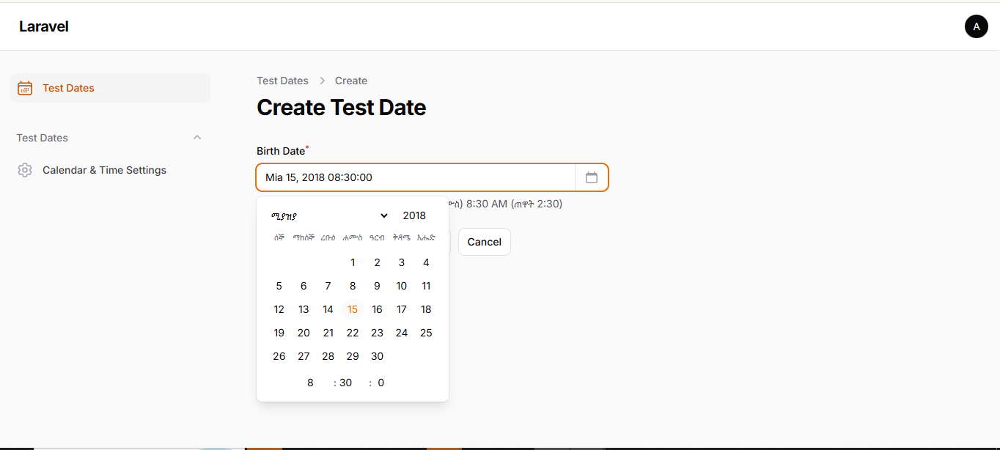
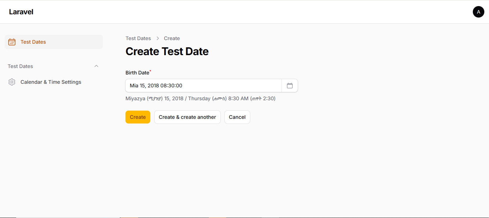
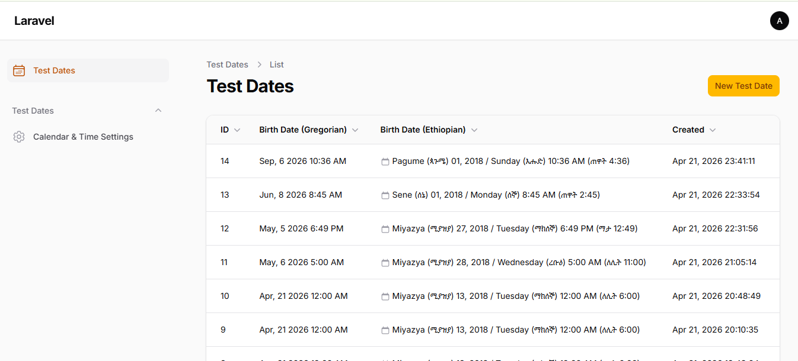
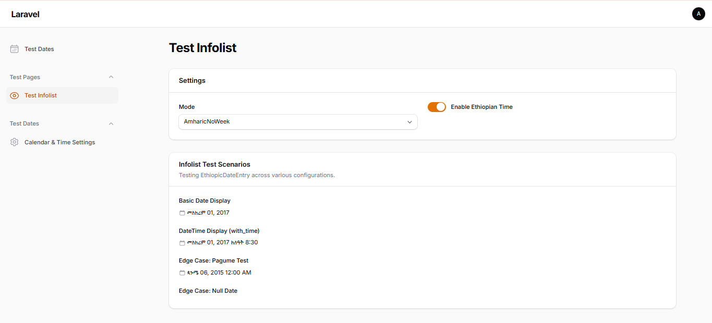

# 🇪🇹 Filament Ethiopic Calendar & Time Engine

*A full Ethiopian calendar **and time system** for Filament PHP — not just a date picker.*

[](https://packagist.org/packages/mammesat/filament-ethiopic-calendar)
[](https://packagist.org/packages/mammesat/filament-ethiopic-calendar)
[](https://github.com/mammesat/filament-ethiopic-calendar/actions?query=workflow%3ATests+branch%3Amain)
[](LICENSE)

---

## 🚀 Overview

**Filament Ethiopic Calendar & Time Engine** brings full Ethiopian date and time support to your Laravel + Filament applications.

It goes beyond simple date conversion by introducing:

* 📅 **Ethiopian calendar** (Gregorian ↔ Ethiopic)
* 🕰️ **Ethiopian time system** (6-hour shifted clock)
* 🔁 **Dual display modes** (Gregorian + Ethiopic)
* 🌍 **Localization** (Amharic / English)
* 🧠 **Centralized formatting engine**

Perfect for government systems, local Ethiopian businesses, and bilingual applications that require precise date management natively within the Filament ecosystem.

---

## ✨ Why This Package?

Most calendar plugins only convert dates. This package provides a **complete time system**.

```text
Gregorian:  Apr 21, 2026 10:00 AM
Ethiopian:  Miyazya 13, 2018 4:00 ጠዋት
Dual:       Apr 21, 2026 (Miyazya 13, 2018)
            10:00 AM (4:00 ጠዋት)
```

**Built for real-world Ethiopian applications:**
* Schools & universities
* Government systems
* Financial platforms
* Local business tools

---

## 📸 Screenshots

### The Ethiopian Form Picker (with Time Selection)



### Live Helper Text (Dual Time Conversions)



### Dual Calendar & Time Tracking in Tables



### Global Calendar & Time Settings Panel


### Read-Only Infolist Displays



---

## ⚙️ Requirements

| Package            | Version           |
| ------------------ | ----------------- |
| **PHP**      | `^8.2` (Supports 8.3+) |
| **Laravel**  | `^11.0 \| ^12.0 \| ^13.0` |
| **Filament** | `^5.0`          |

---

## 📦 Installation

Install the package via composer:

```bash
composer require mammesat/filament-ethiopic-calendar
```

Publish the config file to globally customize defaults:

```bash
php artisan vendor:publish --tag="filament-ethiopic-calendar-config"
```

If you are upgrading or modifying configuration, it is recommended to clear your caches:

```bash
php artisan optimize:clear
```

---

## 🧩 Core Features

### 📅 Ethiopian Calendar Engine
* **Native Filament Experience:** Blends perfectly using Tailwind CSS and Alpine.js.
* **Gregorian DB Storage:** Dates are selected in Ethiopic but stored as standard `Y-m-d H:i:s` strings, ensuring Eloquent compatibility.
* **13-Month Support:** Mathematically accurate support for the 13th month (*Pagume*).

### 🕰️ Ethiopian Time System (🔥 Unique Feature)
Unlike standard systems, Ethiopian time:
* Starts at **6:00 AM**
* Uses a **shifted 12-hour clock**
* Has culturally relevant day periods:

| Period           | Gregorian Range | Ethiopian Range |
| ---------------- | --------------- | --------------- |
| ጠዋት (Morning)    | 06:00 – 11:59  | 12:00 – 5:59   |
| ከሰዓት (Afternoon) | 12:00 – 17:59  | 6:00 – 11:59   |
| ማታ (Evening)     | 18:00 – 23:59  | 12:00 – 5:59   |
| ለሊት (Night)      | 00:00 – 05:59  | 6:00 – 11:59   |

---

## 🚀 Basic Usage

### 📝 Form Field

Add the `EthiopicDateTimePicker` to your form schema. It extends Filament's native `DateTimePicker` and inherits its features.

```php
use Mammesat\FilamentEthiopicCalendar\Fields\EthiopicDateTimePicker;

EthiopicDateTimePicker::make('birth_date')
    ->label('Date of Birth')
    ->required()
    // Optional methods to customize behavior per-field:
    ->displayMode('dual')     // 'ethiopic' | 'gregorian' | 'dual'
    ->timeMode('dual')        // 'gregorian' | 'ethiopian' | 'dual'
    ->calendarLocale('am')    // 'am' (Amharic) | 'en' (English)
    ->withTime(true)
    ->showEthiopicHelper(true);

// Or enforce strictly Ethiopic defaults dynamically:
// ->ethiopic() 
```

### 📊 Table Column

Display dates beautifully formatted within your resource tables:

```php
use Mammesat\FilamentEthiopicCalendar\Tables\Columns\EthiopicDateColumn;

EthiopicDateColumn::make('created_at')
    ->label('Created')
    ->displayMode('dual')
    ->timeMode('dual')
    ->withTime()
    ->sortable();
```

### 📋 Infolist Entry

For clean, read-only displays on view pages:

```php
use Mammesat\FilamentEthiopicCalendar\Infolists\Components\EthiopicDateEntry;

EthiopicDateEntry::make('registered_at')
    ->displayMode('ethiopic')
    ->timeMode('ethiopian')
    ->withTime();
```

---

## 🕰️ Ethiopian Time Usage

### Formatting Time Programmatically

Use the `EthiopicFormatter` facade for direct time formatting:

```php
use Mammesat\FilamentEthiopicCalendar\Support\EthiopicFormatter;

// Ethiopian time format
EthiopicFormatter::formatEthiopianTime('10:00');    // "ጠዋት 4:00"
EthiopicFormatter::formatEthiopianTime('00:00');    // "ለሊት 6:00"
EthiopicFormatter::formatEthiopianTime('18:30');    // "ማታ 12:30"

// Full datetime with Ethiopian time
EthiopicFormatter::formatDateTime(
    '2023-09-12 10:30:00',
    'ethiopic',     // display mode
    'ethiopian',    // time mode
);
// Output: "መስከረም 01, 2016 ጠዋት 4:30"
```

### Time Modes

| Mode | Description | Example |
|---|---|---|
| `gregorian` | Standard 12h AM/PM | `10:00 AM` |
| `ethiopian` | Ethiopian shifted clock | `ጠዋት 4:00` |
| `dual` | Both systems shown | `10:00 AM (ጠዋት 4:00)` |

Enable time on any component:

```php
// Form field with Ethiopian time
EthiopicDateTimePicker::make('event_time')
    ->withTime()
    ->timeMode('ethiopian');

// Table column with dual time
EthiopicDateColumn::make('start_at')
    ->withTime()
    ->timeMode('dual');
```

---

## 🧠 Programmatic Formatting API

The `Support\EthiopicFormatter` facade provides static access to all formatting:

```php
use Mammesat\FilamentEthiopicCalendar\Support\EthiopicFormatter;

// Date formatting
EthiopicFormatter::formatDate('2023-09-12', 'ethiopic');    // "መስከረም 01, 2016"
EthiopicFormatter::formatDate('2023-09-12', 'gregorian');   // "Sep, 12 2023"
EthiopicFormatter::formatDate('2023-09-12', 'dual');        // "Sep, 12 2023 (መስከረም 01, 2016)"

// Full datetime formatting
EthiopicFormatter::formatDateTime('2023-09-12 10:30:00', 'ethiopic', 'dual');

// Time only
EthiopicFormatter::formatTime('14:30', 'ethiopian');        // "ከሰዓት 8:30"
EthiopicFormatter::formatTime('14:30', 'gregorian');        // "2:30 PM"

// Month and day names
EthiopicFormatter::monthName(1, 'am');   // "መስከረም"
EthiopicFormatter::monthName(1, 'en');   // "Meskerem"
EthiopicFormatter::dayName(1, 'long', 'am'); // "ሰኞ"
```

---

## 🎨 Configuration & Display Modes

### Full Configuration Reference

Define global defaults in `config/ethiopic-calendar.php`:

| Key | Type | Default | Description |
|---|---|---|---|
| `display_mode` | `string` | `'amharic_no_week'` | Controls how Ethiopic dates are displayed across all UI |
| `locale` | `string` | `'am'` | Locale fallback used when resolving display mode (`am`, `en`, `hybrid`) |
| `calendar_locale` | `string` | `'am'` | Language of month/day names in the calendar popup (`am`, `en`) |
| `with_time` | `bool` | `false` | Enable/disable the time picker globally |
| `time_mode` | `string` | `'gregorian'` | Time system: `gregorian`, `ethiopian`, or `dual` |
| `dual_time_format` | `string` | `':gregorian (:ethiopian)'` | Template for dual time mode display |
| `timezone` | `string` | `'Africa/Addis_Ababa'` | Default timezone for operations |

```php
// config/ethiopic-calendar.php
return [
    'display_mode'     => 'amharic_no_week',
    'locale'           => 'am',
    'calendar_locale'  => 'am',
    'with_time'        => false,
    'time_mode'        => 'gregorian',
    'dual_time_format' => ':gregorian (:ethiopian)',
    'timezone'         => 'Africa/Addis_Ababa',
];
```

### Settings Resolution

Configuration values follow this priority chain:

```text
Field Override → Config File → Default
```

Per-field overrides (e.g., `->displayMode('dual')`) always take priority over global config values.

### 🔁 Available Display Modes

| Enum Value                  | Simple API | Description                          | Example Output                              |
| --------------------------- | ---------- | ------------------------------------ | ------------------------------------------- |
| `AmharicNoWeek`            | `'ethiopic'` | Default Amharic, no weekday          | መስከረም 01, 2017                         |
| `CleanGregorian`           | `'gregorian'`| Pure Gregorian format              | Sep, 06 2026                                |
| `Hybrid`                   | `'dual'`   | Bilingual (Amharic + English)        | Sep, 06 2026 (መስከረም 01, 2017)           |
| `AmharicCombined`         | —          | Fully localized Amharic with weekday | መስከረም 01, 2017 / ሰኞ                  |
| `TransliterationCombined` | —          | English transliteration with weekday | Meskerem 01, 2017 / Monday                  |
| `CompactAmharic`          | —          | Compact spacing Amharic              | መስከረም 01, 2017 ሰኞ                    |
| `TransliterationNoWeek`   | —          | English transliteration, no weekday  | Meskerem 01, 2017                           |

---

## 🧠 Architecture & How It Works

This package is built with a clean, layered architecture:

1. **`EthiopicCalendarService`:** Date conversion using Julian Day Number math.
2. **`EthiopicTimeService`:** Solves the 6-hour shifted clock logic.
3. **`EthiopicFormatter`:** The Single Source of Truth (`SSOT`) for UI display strings.
4. **`SettingsResolver`:** Unified config resolution (Field Override → Config → Default).

**The Workflow:**
1. **Selection**: User interacts with an entirely Ethiopic calendar interface.
2. **Internal Math**: Alpine.js instantly converts the selection to the corresponding Gregorian date.
3. **Storage**: It stores silently in your database as standard `Y-m-d H:i:s`. *Zero database migrations required.*
4. **Retrieval**: When displaying the date, `EthiopicFormatter` converts it back to the precise Ethiopic format.

---

## 🔄 Backward Compatibility

* Existing `EthiopicDatePicker` syntax still works completely.
* It is mapped safely to the new `EthiopicDateTimePicker` architecture.
* No breaking changes between v1.0 and v1.1.

---

## 🐛 Troubleshooting

**Dates not converting correctly?**
Ensure your database column type is `DATE`, `DATETIME`, or `TIMESTAMP`. The plugin expects standard Gregorian strings.

**Calendar CSS/JS issues?**
Ensure you have registered the plugin assets if you are using a custom panel. The package does this automatically for standard Filament Admin setups.

---

## 🧪 Testing

```bash
composer test
```
✔ 80+ tests
✔ Full coverage for calendar conversion, time system, formatting logic, and settings resolution.

---

## 🗺️ Roadmap

### v1.x
* ✅ Calendar conversion
* ✅ Ethiopian time system
* ✅ Dual display modes
* ✅ Centralized formatting engine
* ✅ Settings resolution system

### v2.0
* 🔜 Native Ethiopic calendar UI (no Flatpickr)
* 🔜 Advanced localization system
* 🔜 Multi-calendar support (extensible engine)

---

## 🤝 Contributing

Contributions are welcome! Please open issues or pull requests for bugs, improvements, or localization additions. See [CONTRIBUTING](CONTRIBUTING.md) for details.

---

## 🔒 Security Vulnerabilities

If you discover any security-related issues, please email instead of using the issue tracker.

---

## 📄 License

The MIT License (MIT). Please see [License File](LICENSE) for more information.

---

## 🧠 Final Note

**This package is not just about formatting dates.**

It defines how Ethiopian calendar and time systems natively integrate into modern Laravel applications.
